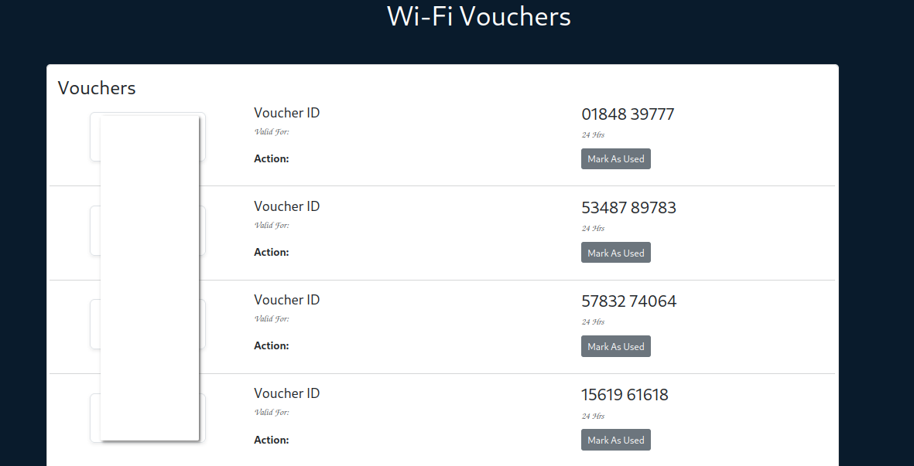

# UniFi Voucher Generator

Generates UniFi Hotspot vouchers using the UniFi controller API saved to a csv file which can then
be easily imported to mongodb - A django app then reads the db and displays the vouchers
Django app courtesy of [@Frost-Codes](https://github.com/Frost-Codes)

This should work on any Linux/Mac machine that can reach the UniFi controller - Bash shell required




## Setup

1. Clone the repo:

```
git clone https://github.com/m0ckinjay/unifi-voucher-generator-for-mongodb-storage.git
```

2. Set the variables in `unifi-api.sh` with your controller's details (username, password, baseurl, site).


## To create vouchers

1. Run 
```./gen.sh $time $amount```

   Example ./gen.sh 100 10  - 100minutes 10 codes. 

## To authenticate a client using their mac-address

1. Run 
```./runner.sh <mac-address> <time> ```

    Example ./runner.sh 00:00:00:00:00:00 525600 - Authenticate client with mac 00:00:00:00:00:00 for 525600 minutes
